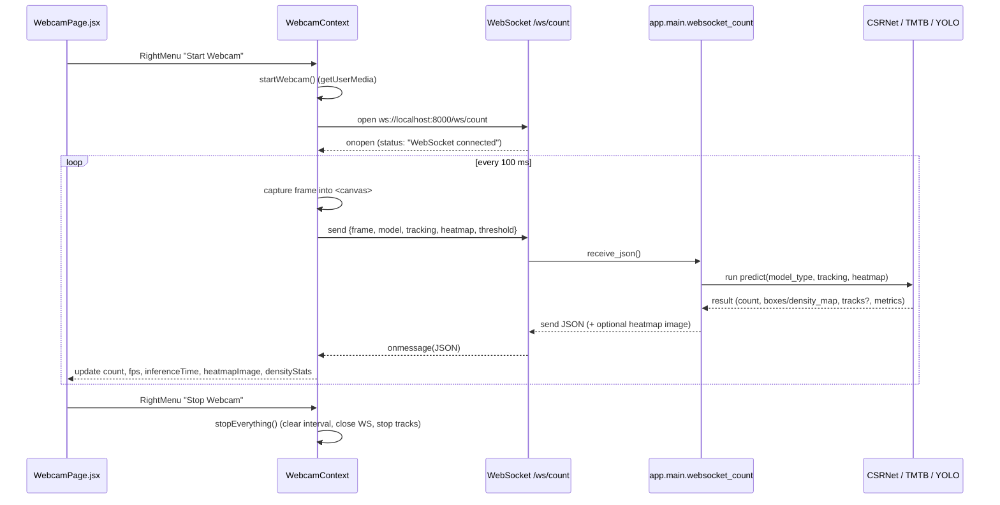

# Webcam Pipeline Report

## Scope

This report documents the **Live Webcam** pipeline end-to-end, from the React UI through the `WebcamContext` to the FastAPI backend WebSocket handlers and model APIs. It focuses on:

- **Control flow** (start / capture / stop lifecycle).
- **Data flow** (WebSocket payload & response shapes).
- **Model routing** and how the `model`, `tracking`, and `heatmap` flags are interpreted.
- **Differences** between webcam `/ws/count`, external camera `/ws/external-camera`, and video `/ws/video-process`.
- **Known issues** that affect correctness or observability of the webcam pipeline.

---

## Key URLs and Endpoints

- **Backend base URL**

  - `http://localhost:8000`

- **WebSocket endpoints**

  - Live webcam frames: `ws://localhost:8000/ws/count`
  - External IP camera: `ws://localhost:8000/ws/external-camera`
  - Video processing: `ws://localhost:8000/ws/video-process`

- **REST model endpoints (image upload)**
  - CSRNet: `POST /api/v1/csrnet/count`
  - TMTB (VMamba): `POST /api/v1/tmtb/count`
  - YOLOv8 (detailed detect): `POST /api/v1/yolo/detect`

The **Live Webcam** experience uses **only** `ws://localhost:8000/ws/count`. The other endpoints are included here for comparison across input modes.

---

## Frontend Flow: Live Webcam

### Components involved

- **`Webcam` page** (`frontend/src/pages/webcam/Webcam.js`)

  - Renders layout, status panel, live video element, stats, and debug cards.
  - Uses the `WebcamContext` for all streaming state and data.

- **`WebcamContext`** (`frontend/src/context/WebcamContext.js`)

  - Owns the webcam/video lifetime, WebSocket connection, frame capture loop, and all derived metrics/state.
  - Exposes `handleStartStreaming`, `handleStopStreaming`, `stopEverything`, and model/heatmap/tracking settings.

- **`RightMenu`** (`frontend/src/components/Menu/RightMenu.js`)

  - Provides the **Start / Stop** button.
  - Lets the user choose **model** (`CSRNet`, `VMamba`, `YOLOv8`).
  - Provides **YOLO-only options** (version, confidence threshold, tracking, heatmap toggle).

- **Visualization components**
  - `CSRNetCard`, `HeatmapCard`: present JSON results, density stats, and the returned heatmap image.
  - Debug panel shows `enableHeatmap`, `heatmapImage` presence, and length.

### Start → Capture → Stop lifecycle

1. **User clicks "Start Webcam" in RightMenu**

   - `RightMenu` calls `handleStreamToggle()` → if not streaming, calls `handleStartStreaming()` from `WebcamContext`.

2. **Webcam initialization (`startWebcam`)**

   - Calls `navigator.mediaDevices.getUserMedia` with resolution derived from `settings.resolution`.
   - Binds the returned `MediaStream` to the `<video>` tag via `videoRef.current.srcObject` and waits for metadata.

3. **WebSocket connection (`connectWebSocket`)**

   - Opens `ws://localhost:8000/ws/count`.
   - On success, sets status to `"WebSocket connected"` and stores the `WebSocket` in `wsRef.current`.
   - On errors or timeouts, shows Bootstrap toast notifications and rejects the promise.

4. **Frame capture loop (`captureAndSend`)**

   - Every 100 ms (`setInterval(captureAndSend, 100)`):
     - Draws the `<video>` frame into a hidden `<canvas>`.
     - Encodes the canvas as `image/jpeg` base64 via `canvas.toDataURL("image/jpeg", 0.8)`.
     - Builds the outbound payload (see below) and sends it via `wsRef.current.send(JSON.stringify(payload))`.

5. **Stopping and cleanup (`handleStopStreaming` / `stopEverything`)**
   - Clears the capture interval.
   - Closes the WebSocket if open.
   - Stops all media tracks and clears `videoRef.current.srcObject`.
   - Resets metrics (`count`, `fps`, `inferenceTime`, `results`, `heatmapImage`, `densityStats`).

### WebSocket payload shape (webcam → backend)

Each captured frame is sent as JSON:

```json
{
  "frame": "data:image/jpeg;base64,...",
  "model": "csrnet" | "vmamba" | "yolov8",
  "tracking": true | false,
  "heatmap": true | false,
  "threshold": 0.1 – 0.95
}
```

Notes:

- `model` comes from `selectedModel.toLowerCase()` where `selectedModel ∈ {"CSRNet","VMamba","YOLOv8"}`.
- `tracking` and `heatmap` come from toggles in `RightMenu`.
- `threshold` is controlled only in the **YOLO** sub-panel of `RightMenu` and is **currently ignored by the backend**.

---

## Backend Flow: `/ws/count` in `app.main`

Handler: `websocket_count` in `backend/app/main.py`.

High-level behavior:

1. Accepts the WebSocket connection.
2. In a loop, reads JSON messages from the client.
3. Decodes `frame` / `image` field from base64 into a `PIL.Image`.
4. Selects the model implementation based on the `model` field.
5. Runs the corresponding prediction API (CSRNet / TMTB / YOLO).
6. Optionally generates heatmaps or annotated images.
7. Adds tracking & advanced metrics for YOLO-tracking.
8. Sends a JSON response for each frame.

### Request parsing

For each message:

- `frame_data = data.get("frame") or data.get("image")`
- `model_type = data.get("model", "csrnet")`
- `enable_tracking = data.get("tracking", False)`
- `return_heatmap = data.get("heatmap", False)`

`threshold` is **not** used.

### Model selection logic

Backend defines a **YOLO variant map**:

```python
yolo_model_map = {
  "yolo": "yolov8n.pt",
  "yolo-nano": "yolov8n.pt",
  "yolo-small": "yolov8s.pt",
  "yolo-medium": "yolov8m.pt",
  "yolo-large": "yolov8l.pt",
  "yolo-xlarge": "yolov8x.pt",
}
```

Branching:

- **YOLO variants** (object detection, optional tracking)

  - Condition: `model_type.lower() in yolo_model_map and yolo_api`.
  - If `enable_tracking` and `UnifiedCounter` available:
    - Converts image to BGR numpy array.
    - Calls `UnifiedCounter.predict(..., return_details=True, return_visualization=return_heatmap)`.
    - Tracking info (`tracks`, `unique_count`, `speed_stats`, `advanced_metrics`) added to response.
  - Else, falls back to `yolo_api.predict(image, checkpoint_path=..., source="webcam", return_boxes=True, visualize=return_heatmap)`.

- **TMTB / VMamba (density regression)**

  - Condition: `model_type.lower() == "tmtb" and tmtb_api`.
  - Calls `tmtb_api.predict(image, source="webcam")`.

- **CSRNet (density regression, default)**
  - Fallback when the above conditions do not match.
  - Calls `csrnet_api.predict(image, source="webcam", return_density_map=return_heatmap)`.

**Important mismatch (documented in Issues W‑001 & W‑002):**

- Frontend sends `"vmamba"` and `"yolov8"`.
- Backend only recognizes `"tmtb"` (for VMamba) and the explicit **YOLO variant strings** (`"yolo-nano"`, `"yolo-small"`, ...).
- As a result, in the current code path:
  - Selecting **VMamba** or **YOLOv8** on the webcam UI actually runs **CSRNet** on the backend.

### Response shape (per frame)

Base fields returned for all models:

```json
{
  "success": true,
  "model": "csrnet" | "tmtb" | "yolo-...",
  "count": <number>,
  "inference_time_ms": <number>,
  "frame_number": <int>,
  "fps": <number>
}
```

YOLO-specific additions:

- `boxes`: list of `{x1, y1, x2, y2, confidence}`.
- `num_detections`: length of `boxes`.
- `average_confidence`: mean box confidence.
- If tracking is enabled:
  - `unique_count`: distinct tracked IDs.
  - `tracks`: trajectory objects with position, state, and history.
  - `speed_stats`: aggregate per-frame speed metrics.
  - `advanced_metrics`: optional density/speed metrics from `UnifiedCounter.get_advanced_metrics`.

Heatmap-related fields:

- `heatmap`: base64-encoded JPEG image; semantics depend on model family (see below).
- `density_map_stats`: only present for CSRNet/TMTB density models.

---

## Heatmap and Tracking Semantics

### `heatmap` flag (webcam)

- **Input (`WebcamContext` → `/ws/count`)**

  - `heatmap: true` means: "Please compute and send a `heatmap` image if the model supports it".

- **CSRNet / TMTB**

  - `return_density_map=True` is passed into CSRNet/TMTB APIs.
  - Backend uses `csrnet_api.generate_heatmap(density_map, image)` to produce an RGB heatmap overlay.
  - Result is JPEG-encoded and returned as `response.heatmap`.

- **YOLO**
  - `return_heatmap=True` is mapped to `visualize=True`.
  - For `yolo_api`, `annotated_image` (original frame + bounding boxes) is encoded and returned as `response.heatmap`.
  - For `UnifiedCounter`, `annotated_image` is similarly used when available.

### Tracking

- Controlled by the `tracking` boolean in the webcam payload.
- Only meaningful when the selected model resolves to a **YOLO** variant **and** `UnifiedCounter` is available.
- When effective, the response includes:
  - `tracks`: each with `id`, `box`, `position`, `state`, `trajectory`, `frames_tracked`, etc.
  - `unique_count`: number of unique track IDs observed.
  - `speed_stats`: average / min / max / std speed per frame.
  - Optional `advanced_metrics` (density/speed metrics via PedPy).

Currently, due to the `model` naming mismatch, this tracking path is **never reached** from the webcam UI.

---

## External Camera and Video Processing (for Comparison)

While Live Webcam talks to `/ws/count`, the other streaming modes behave slightly differently:

- **External Camera (`/ws/external-camera`)**

  - Client sends an initial configuration message:
    - `{ "camera_url": "...", "model": "csrnet" | "yolo-nano" | ..., "tracking": bool }`.
  - Then repeatedly sends `{ "action": "get_frame" }`.
  - Backend:
    - Fetches frames using `camera_client.get_frame(camera_url)`.
    - Either uses `UnifiedCounter` (YOLO + tracking) or the **GatedModelRouter** (`model_router.predict`) for CSRNet/TMTB/YOLO.
    - Always tries to compute a `heatmap` image when possible and returns:
      - `frame`: original frame image (base64 JPEG).
      - `heatmap`: overlay image (if generated).

- **Video Upload (`/ws/video-process`)**
  - Client first sends config: `{ "model": "yolo-nano" | ..., "tracking": bool, "confidence": number }`.
  - Then streams frames as `{ "frame": "data:image/jpeg;base64,..." }` messages.
  - Backend primarily supports YOLO (+ tracking) here and always visualizes detections.

These flows share model APIs with `/ws/count` but use different transport patterns and slightly different assumptions about tracking and heatmap behavior.

---

## Mermaid: End-to-End Webcam Pipeline



---

## Known Issues Affecting the Webcam Pipeline

These are described in detail in `issues_overview.md` but summarized here for quick reference:

- **W‑001 – Webcam `model` values do not match backend expectations (Critical)**

  - `"vmamba"` and `"yolov8"` from the frontend do not match `"tmtb"` and `"yolo-*"` expected by `/ws/count`.
  - Result: webcam always runs CSRNet even when VMamba or YOLOv8 is selected.

- **W‑002 – YOLO version setting not wired to backend (Major)**

  - `settings.yoloVersion` in `RightMenu` is never encoded into the `model` string.
  - Even after fixing W‑001, all webcam YOLO runs would default to a single checkpoint unless this mapping is added.

- **W‑003 – `threshold` flag unused (Minor)**

  - `threshold` is sent in the payload but ignored in `websocket_count`, so changing it has no effect on detection.

- **W‑004 – Dual `/ws/count` implementations (Minor / documentation)**
  - There is a legacy multi-model `/ws/count` in `predict_multimodel.py` with a different contract.
  - The app actually runs `app.main:app` via `backend/run.py`.

The **Fix Plan** in `fix_plan.md` proposes small, targeted changes to align the webcam pipeline with its intended behavior.
