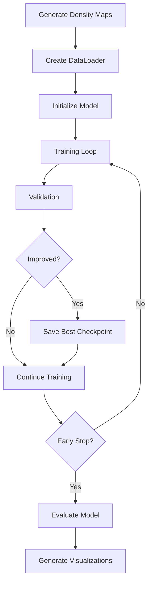

# CSRNet Fine-Tuning Pipeline

Complete pipeline for fine-tuning CSRNet on ShanghaiTech Part A dataset.

## 📁 Directory Structure

```
ml/
├── src/csrnet/training/
│   ├── generate_density_maps.py  # Generate density maps from annotations
│   ├── dataset.py                # PyTorch Dataset class
│   ├── train.py                  # Training script
│   ├── evaluate.py               # Evaluation script
│   └── logs/                     # Training logs and TensorBoard
├── csrnet_config.yaml            # Training configuration
├── fine-tunned/csrnet/           # Saved checkpoints
└── src/utils/csrnet_training_test.ipynb  # Quick test notebook
```

## 🚀 Quick Start

### Phase 1: Data Preparation (5-10 minutes)

#### Step 1.1: Verify Dataset

```bash
# Dataset should be at:
# ml/datasets/raw/ShanghaiTech/ShanghaiTech/part_A/
#   ├── train_data/
#   │   ├── images/        (300 images)
#   │   └── ground-truth/  (300 .mat files)
#   └── test_data/
#       ├── images/        (182 images)
#       └── ground-truth/  (182 .mat files)
```

#### Step 1.2: Generate Density Maps

```bash
python ml/src/csrnet/training/generate_density_maps.py
```

Expected output:

- `ml/datasets/processed/part_A/train_data/density_maps/` (300 .h5 files)
- `ml/datasets/processed/part_A/test_data/density_maps/` (182 .h5 files)

#### Step 1.3: Test Dataset Loading

```bash
python ml/src/csrnet/training/dataset.py
```

### Phase 2: Training (2-4 hours depending on GPU)

#### Step 2.1: Configure Training

Edit `ml/csrnet_config.yaml` if needed:

- Adjust `batch_size` based on GPU memory
- Modify `epochs` for training duration
- Change `learning_rate` if needed

#### Step 2.2: Start Training

```bash
python ml/src/csrnet/training/train.py
```

Or with custom config:

```bash
python ml/src/csrnet/training/train.py --config path/to/config.yaml
```

#### Step 2.3: Monitor Training

```bash
tensorboard --logdir ml/src/csrnet/training/logs/tensorboard
```

Open browser: http://localhost:6006

### Phase 3: Evaluation

#### Step 3.1: Evaluate Best Model

```bash
python ml/src/csrnet/training/evaluate.py \
    --checkpoint ml/fine-tunned/csrnet/csrnet_best.pth \
    --visualize \
    --samples 10
```

#### Step 3.2: Evaluate Specific Checkpoint

```bash
python ml/src/csrnet/training/evaluate.py \
    --checkpoint ml/fine-tunned/csrnet/csrnet_epoch_050_loss_0.0234.pth \
    --visualize
```

## 📊 Training Configuration

### Key Parameters (ml/csrnet_config.yaml)

| Parameter        | Default | Description                 |
| ---------------- | ------- | --------------------------- |
| `epochs`         | 100     | Total training epochs       |
| `batch_size`     | 4       | Batch size (adjust for GPU) |
| `learning_rate`  | 1e-5    | Initial learning rate       |
| `lr_step_size`   | 30      | LR decay every N epochs     |
| `lr_gamma`       | 0.5     | LR decay factor             |
| `validate_every` | 5       | Validation frequency        |
| `save_frequency` | 5       | Checkpoint save frequency   |

### GPU Memory Requirements

| Batch Size | GPU Memory | Training Speed |
| ---------- | ---------- | -------------- |
| 1          | ~3 GB      | Slow           |
| 2          | ~5 GB      | Moderate       |
| 4          | ~9 GB      | Good           |
| 8          | ~15 GB     | Fast           |

## 📈 Expected Results

### ShanghaiTech Part A Benchmarks

| Metric | Expected Range | Target |
| ------ | -------------- | ------ |
| MAE    | 60-80          | <70    |
| MSE    | 90-120         | <100   |
| RMSE   | 9.5-11.0       | <10    |

_Note: Results vary based on initialization and training duration_

## 🔍 Monitoring Training

### TensorBoard Metrics

1. **train/loss** - Training loss per epoch
2. **train/mae** - Training MAE per epoch
3. **val/loss** - Validation loss
4. **val/mae** - Validation MAE
5. **val/rmse** - Validation RMSE
6. **train/lr** - Learning rate schedule

### Log Files

- `ml/src/csrnet/training/logs/training.log` - Detailed training log
- `ml/src/csrnet/training/logs/tensorboard/` - TensorBoard events

## 🐛 Debugging

### Quick Test Notebook

```bash
jupyter notebook ml/src/utils/csrnet_training_test.ipynb
```

Run all cells to verify:

- ✅ Dataset loading
- ✅ Density map generation
- ✅ Model forward pass
- ✅ Configuration

### Common Issues

#### 1. "Density maps not found"

```bash
# Solution: Generate density maps
python ml/src/csrnet/training/generate_density_maps.py
```

#### 2. "CUDA out of memory"

```yaml
# Solution: Reduce batch size in ml/csrnet_config.yaml
training:
  hyperparameters:
    batch_size: 2 # Reduce from 4 to 2
```

#### 3. "No module named 'ml'"

```bash
# Solution: Run from project root
cd "D:\College\Major Project"
python ml/src/csrnet/training/train.py
```

#### 4. "Checkpoint not found"

```yaml
# Solution: Check checkpoint path in config
model:
  pretrained_checkpoint: "ml/checkpoints/csrnet.pth"
```

## 📦 Checkpoints

### Checkpoint Structure

```python
{
    'epoch': 50,
    'model_state_dict': {...},
    'optimizer_state_dict': {...},
    'loss': 0.0234,
    'best_val_loss': 0.0234,
    'config': {...}
}
```

### Checkpoint Management

- **Regular checkpoints**: Saved every N epochs (configurable)
- **Best checkpoint**: `csrnet_best.pth` (lowest validation loss)
- **Keep last N**: Only last 3 checkpoints retained (configurable)

### Loading Checkpoints

```python
from ml.src.models.csrnet.csrnet import load_csrnet

model = load_csrnet('ml/fine-tunned/csrnet/csrnet_best.pth', device='cuda')
```

## 🎯 Evaluation Outputs

### Metrics

- `ml/src/csrnet/training/logs/evaluation/` - Evaluation plots
  - `scatter_plot.png` - Predictions vs Ground Truth
  - `error_distribution.png` - Error histogram
  - `abs_error_distribution.png` - Absolute error histogram
  - `error_vs_gt.png` - Error vs crowd size

### Sample Visualizations

- `ml/src/csrnet/training/logs/evaluation/samples/` - Sample predictions
  - Original image + Ground truth + Prediction

## 🔄 Training Pipeline



## 📝 Training Log Example

```
🚀 Starting CSRNet training
🖥️  Device: cuda
📥 Loading checkpoint: ml/checkpoints/csrnet.pth
📊 Total parameters: 16,261,825
📁 Train batches: 75
📁 Test batches: 182

Epoch 1/100 - Train Loss: 0.0456, Train MAE: 78.34
Epoch 5/100 - Train Loss: 0.0234, Train MAE: 65.21 - Val Loss: 0.0267, Val MAE: 68.45
💾 Saved checkpoint: csrnet_epoch_005_loss_0.0267.pth
🏆 Saved best checkpoint: csrnet_best.pth

...

✅ Training complete!
🏆 Best validation loss: 0.0234
```

## 🎓 Next Steps After Training

1. **Compare with baseline**:

   ```bash
   python ml/src/csrnet/training/evaluate.py --checkpoint ml/checkpoints/csrnet.pth
   python ml/src/csrnet/training/evaluate.py --checkpoint ml/fine-tunned/csrnet/csrnet_best.pth
   ```

2. **Deploy fine-tuned model**:

   - Replace `ml/checkpoints/csrnet.pth` with your best checkpoint
   - Update backend API to use new checkpoint

3. **Continue training**:
   ```yaml
   # In ml/csrnet_config.yaml
   checkpointing:
     resume_training: true
     resume_checkpoint: "ml/fine-tunned/csrnet/csrnet_epoch_050.pth"
   ```

## 📖 References

- **Original Paper**: [CSRNet: Dilated Convolutional Neural Networks for Understanding the Highly Congested Scenes](https://arxiv.org/abs/1802.10062)
- **Dataset**: [ShanghaiTech Crowd Counting Dataset](https://github.com/desenzhou/ShanghaiTechDataset)

## 🤝 Support

For issues or questions:

1. Check the debug notebook: `ml/src/utils/csrnet_training_test.ipynb`
2. Review training logs: `ml/src/csrnet/training/logs/training.log`
3. Check TensorBoard for metrics

---

**Last Updated**: October 10, 2025  
**Status**: ✅ Ready for Training
